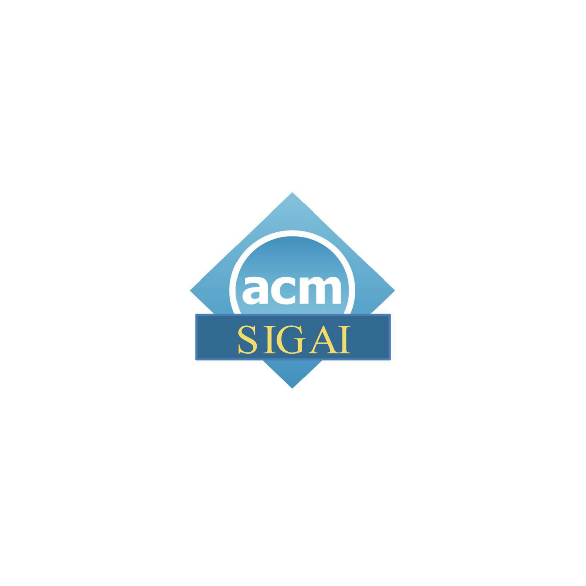

---
# An instance of the Featurette widget.
# Documentation: https://wowchemy.com/docs/page-builder/
widget: featurette

# This file represents a page section.
headless: true

# Order that this section appears on the page.
weight: 50

title: Sponsors
subtitle:

content:
  # Automatically link email and phone or display as text?
  # autolink: true
  
design:
  columns: '2'
  
# Showcase personal skills or business features.
# - Add/remove as many `feature` blocks below as you like.
# - For available icons, see: https://wowchemy.com/docs/page-builder/#icons

  

    

      <strong>Platinum sponsor</strong>
       
      
    

    

      <strong>Platinum sponsor</strong>
       
      
    

    

      <strong>Silver sponsor</strong>
       
      
    

  

  

    

      
    

    

      
    

    

      
    

  

  
# Uncomment to use emoji icons.
#- icon: ":smile:"
#  icon_pack: "emoji"
#  name: "Emojiness"
#  description: "100%"  

# Uncomment to use custom SVG icons.
# Place custom SVG icon in `assets/images/icon-pack/`, creating folders if necessary.
# Reference the SVG icon name (without `.svg` extension) in the `icon` field.

---

