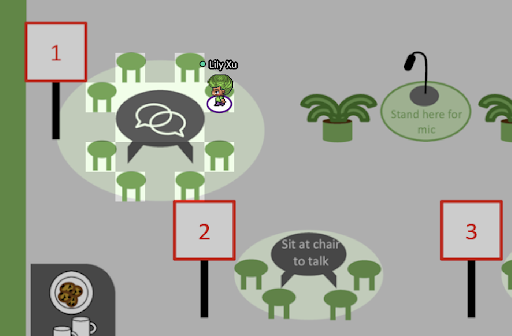
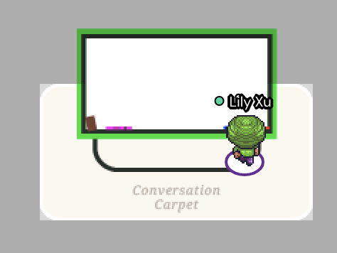

<link href='https://fonts.googleapis.com/css?family=Roboto:400,100,300,700' rel='stylesheet' type='text/css'>
<link rel="stylesheet" href="https://stackpath.bootstrapcdn.com/font-awesome/4.7.0/css/font-awesome.min.css">
<link rel="stylesheet" href="css/style.css">

# **EAAMO’21 Socials** #
___

Please enter the [EAAMO’21 Gather Lounge](https://gather.town/app/8ZCK5ITC73SgbtQE/eaamo-2021) for all things social! Of course you can always chat with other participants in the Gather conference space at any point throughout the event.

## Table Discussion Socials (every day)

---

Every day, we will have table discussion socials with discussion facilitators. These socials will all occur during the “Lunch break” with the exception of Tuesday’s regional socials, which will occur immediately before and after the main conference program. Take a seat at one of the tables to join the conversation! See below for a full list of topics per day along with the scheduled facilitators.

## Collaborative Art (async)

---

Head over to the whiteboard to contribute to a collective drawing of your take on a visual representation of EAAMO. Up for interpretation!

 
 
 

## Quotation Compilation (async)

---

Please share quotes that stuck out to you from one of the talks, posters, papers, or socials throughout the conference! We would love to see them listed here, and also encourage you to tweet — there will be awards for the best tweets! (Tag @ACMEAAMO or #EAAMO2021)

## Schedule

---



<table class="table myaccordion table-hover" id="accordion">
  <thead>
    <tr>
      <th></th>
      <th>Time</th>
      <th>Affinity group socials</th>
      <th>Table</th>
      <th>Facilitators</th>
      <th>&nbsp;</th>
    </tr>
  </thead>
  <tbody>
    <tr eaamo-toggle="collapse" eaamo-target="#collapseMon" aria-expanded="false" aria-controls="collapseMon" class="collapsed">
      <th scope="row"></th>
      <td>13:15 - 14:00 (ET)</td>
      <td><b>Black affinity social</b></td>
      <td><b>Tables 1 & 2</b></td>
      <td><b>Christian Ikeokwu, Ezinne Nwankwo</b></td>
      <td>
      	<i class="fa" aria-hidden="false"></i>
    	</td>
    </tr>
    <tr eaamo-toggle="collapse" eaamo-target="#collapseMon" aria-expanded="false" aria-controls="collapseMon" class="collapsed">
      <th scope="row"></th>
      <td>13:15 - 14:00 (ET)</td>
      <td><b>Latinx affinity social</b></td>
      <td><b>Tables 3 & 4</b></td>
      <td><b>Tilsa Ore Monago, Ramon Vilarino</b></td>
      <td>
      	<i class="fa" aria-hidden="false"></i>
    	</td>
    </tr>
     <tr eaamo-toggle="collapse" eaamo-target="#collapseMon" aria-expanded="false" aria-controls="collapseMon" class="collapsed">
      <th scope="row"></th>
      <td>13:15 - 14:00 (ET)</td>
      <td><b>Queer affinity social</b></td>
      <td><b>Tables 5 & 6</b></td>
      <td><b>Logan Stapleton</b></td>
      <td>
      	<i class="fa" aria-hidden="false"></i>
    	</td>
    </tr>
</table>





<table class="table myaccordion table-hover" id="accordion">
  <thead>
    <tr>
      <th></th>
      <th>Time</th>
      <th>Regional socials</th>
      <th>Table</th>
      <th>Facilitators</th>
      <th>&nbsp;</th>
    </tr>
  </thead>
  <tbody>
    <tr eaamo-toggle="collapse" eaamo-target="#collapseMon" aria-expanded="false" aria-controls="collapseMon" class="collapsed">
      <th scope="row"></th>
      <td>10:00 - 10:45 (ET)</td>
      <td><b>Africa</b></td>
      <td><b>Tables 1 & 2</b></td>
      <td><b>Lynn Kirabo, Benjamin Otieno</b></td>
      <td>
      	<i class="fa" aria-hidden="false"></i>
    	</td>
    </tr>
    <tr eaamo-toggle="collapse" eaamo-target="#collapseMon" aria-expanded="false" aria-controls="collapseMon" class="collapsed">
      <th scope="row"></th>
      <td>10:00 - 10:45 (ET)</td>
      <td><b>Asia–Pacific</b></td>
      <td><b>Tables 3 & 4</b></td>
      <td><b>No set facilitator</b></td>
      <td>
      	<i class="fa" aria-hidden="false"></i>
    	</td>
    </tr>
    <tr eaamo-toggle="collapse" eaamo-target="#collapseMon" aria-expanded="false" aria-controls="collapseMon" class="collapsed">
      <th scope="row"></th>
      <td>10:00 - 10:45 (ET)</td>
      <td><b>Europe</b></td>
      <td><b>Tables 5 & 6</b></td>
      <td><b>Sakina Hansen, Corinna Hertweck</b></td>
      <td>
      	<i class="fa" aria-hidden="false"></i>
    	</td>
    </tr>
    <tr eaamo-toggle="collapse" eaamo-target="#collapseMon" aria-expanded="false" aria-controls="collapseMon" class="collapsed">
      <th scope="row"></th>
      <td>17:15 - 18:00 (ET)</td>
      <td><b>Latin America/Caribbean</b></td>
      <td><b>Tables 1 & 2</b></td>
      <td><b>Christian Ramirez Romero</b></td>
      <td>
      	<i class="fa" aria-hidden="false"></i>
    	</td>
    </tr>
    <tr eaamo-toggle="collapse" eaamo-target="#collapseMon" aria-expanded="false" aria-controls="collapseMon" class="collapsed">
      <th scope="row"></th>
      <td>17:15 - 18:00 (ET)</td>
      <td><b>North America</b></td>
      <td><b>Tables 3 & 4</b></td>
      <td><b>No set facilitator</b></td>
      <td>
      	<i class="fa" aria-hidden="false"></i>
    	</td>
    </tr>
</table>





<table class="table myaccordion table-hover" id="accordion">
  <thead>
    <tr>
      <th></th>
      <th>Time</th>
      <th>Research Topics: Day 1</th>
      <th>Table</th>
      <th>Facilitators</th>
      <th>&nbsp;</th>
    </tr>
  </thead>
  <tbody>
    <tr eaamo-toggle="collapse" eaamo-target="#collapseMon" aria-expanded="false" aria-controls="collapseMon" class="collapsed">
      <th scope="row"></th>
      <td>13:15 - 14:00 (ET)</td>
      <td><b>Algorithmic Fairness</b></td>
      <td><b>Table 1</b></td>
      <td><b>Sarah Brown, Kate Donahue</b></td>
      <td>
      	<i class="fa" aria-hidden="false"></i>
    	</td>
    </tr>
    <tr eaamo-toggle="collapse" eaamo-target="#collapseMon" aria-expanded="false" aria-controls="collapseMon" class="collapsed">
      <th scope="row"></th>
      <td>13:15 - 14:00 (ET)</td>
      <td><b>Algorithms, Law, and Policy</b></td>
      <td><b>Table 2</b></td>
      <td><b>No set facilitator</b></td>
      <td>
      	<i class="fa" aria-hidden="false"></i>
    	</td>
    </tr>   
    <tr eaamo-toggle="collapse" eaamo-target="#collapseMon" aria-expanded="false" aria-controls="collapseMon" class="collapsed">
      <th scope="row"></th>
      <td>13:15 - 14:00 (ET)</td>
      <td><b>Civic Participation</b></td>
      <td><b>Table 3</b></td>
      <td><b>Paul Gölz, Anson Kahng</b></td>
      <td>
      	<i class="fa" aria-hidden="false"></i>
    	</td>
    </tr> 
    <tr eaamo-toggle="collapse" eaamo-target="#collapseMon" aria-expanded="false" aria-controls="collapseMon" class="collapsed">
      <th scope="row"></th>
      <td>13:15 - 14:00 (ET)</td>
      <td><b>Data Economies </b></td>
      <td><b>Table 4/b></td>
      <td><b>Ali Alkhatib, Charles Cui</b></td>
      <td>
      	<i class="fa" aria-hidden="false"></i>
    	</td>
    </tr> 
    <tr eaamo-toggle="collapse" eaamo-target="#collapseMon" aria-expanded="false" aria-controls="collapseMon" class="collapsed">
      <th scope="row"></th>
      <td>13:15 - 14:00 (ET)</td>
      <td><b>Development </b></td>
      <td><b>Table 5/b></td>
      <td><b>Tejumade Afonja</b></td>
      <td>
      	<i class="fa" aria-hidden="false"></i>
    	</td>
    </tr> 
    <tr eaamo-toggle="collapse" eaamo-target="#collapseMon" aria-expanded="false" aria-controls="collapseMon" class="collapsed">
      <th scope="row"></th>
      <td>13:15 - 14:00 (ET)</td>
      <td><b>Education</b></td>
      <td><b>Table 6/b></td>
      <td><b>No set facilitator</b></td>
      <td>
      	<i class="fa" aria-hidden="false"></i>
    	</td>
    </tr>
    <tr eaamo-toggle="collapse" eaamo-target="#collapseMon" aria-expanded="false" aria-controls="collapseMon" class="collapsed">
      <th scope="row"></th>
      <td>13:15 - 14:00 (ET)</td>
      <td><b>Enviroment</b></td>
      <td><b>Table 7/b></td>
      <td><b>Steven Yin, Lily Xu</b></td>
      <td>
      	<i class="fa" aria-hidden="false"></i>
    	</td>
    </tr> 
    <tr eaamo-toggle="collapse" eaamo-target="#collapseMon" aria-expanded="false" aria-controls="collapseMon" class="collapsed">
      <th scope="row"></th>
      <td>13:15 - 14:00 (ET)</td>
      <td><b>Healthcare</b></td>
      <td><b>Table 8/b></td>
      <td><b>Jakob Jonnerby, Bryan Wilder</b></td>
      <td>
      	<i class="fa" aria-hidden="false"></i>
    	</td>
    </tr> 
</table>





<table class="table myaccordion table-hover" id="accordion">
  <thead>
    <tr>
      <th></th>
      <th>Time</th>
      <th>Research Topics: Day 1</th>
      <th>Table</th>
      <th>Facilitators</th>
      <th>&nbsp;</th>
    </tr>
  </thead>
  <tbody>
    <tr eaamo-toggle="collapse" eaamo-target="#collapseMon" aria-expanded="false" aria-controls="collapseMon" class="collapsed">
      <th scope="row"></th>
      <td>13:15 - 14:00 (ET)</td>
      <td><b>Algorithmic Fairness</b></td>
      <td><b>Table 1</b></td>
      <td><b>Grace Abuhamad, Jessie Finocchiaro</b></td>
      <td>
      	<i class="fa" aria-hidden="false"></i>
    	</td>
    </tr>
    <tr eaamo-toggle="collapse" eaamo-target="#collapseMon" aria-expanded="false" aria-controls="collapseMon" class="collapsed">
      <th scope="row"></th>
      <td>13:15 - 14:00 (ET)</td>
      <td><b>Algorithms, Law, and Policy</b></td>
      <td><b>Table 2</b></td>
      <td><b>Fernando Delgado</b></td>
      <td>
      	<i class="fa" aria-hidden="false"></i>
    	</td>
    </tr>   
    <tr eaamo-toggle="collapse" eaamo-target="#collapseMon" aria-expanded="false" aria-controls="collapseMon" class="collapsed">
      <th scope="row"></th>
      <td>13:15 - 14:00 (ET)</td>
      <td><b>Civic Participation</b></td>
      <td><b>Table 3</b></td>
      <td><b>No set facilitator</b></td>
      <td>
      	<i class="fa" aria-hidden="false"></i>
    	</td>
    </tr> 
    <tr eaamo-toggle="collapse" eaamo-target="#collapseMon" aria-expanded="false" aria-controls="collapseMon" class="collapsed">
      <th scope="row"></th>
      <td>13:15 - 14:00 (ET)</td>
      <td><b>Data Economies </b></td>
      <td><b>Table 4/b></td>
      <td><b>Ali Alkhatib</b></td>
      <td>
      	<i class="fa" aria-hidden="false"></i>
    	</td>
    </tr> 
    <tr eaamo-toggle="collapse" eaamo-target="#collapseMon" aria-expanded="false" aria-controls="collapseMon" class="collapsed">
      <th scope="row"></th>
      <td>13:15 - 14:00 (ET)</td>
      <td><b>Development </b></td>
      <td><b>Table 5/b></td>
      <td><b>Dina Machuve</b></td>
      <td>
      	<i class="fa" aria-hidden="false"></i>
    	</td>
    </tr> 
    <tr eaamo-toggle="collapse" eaamo-target="#collapseMon" aria-expanded="false" aria-controls="collapseMon" class="collapsed">
      <th scope="row"></th>
      <td>13:15 - 14:00 (ET)</td>
      <td><b>Education</b></td>
      <td><b>Table 6/b></td>
      <td><b>Caterina Calsamiglia, Renzhe Yu</b></td>
      <td>
      	<i class="fa" aria-hidden="false"></i>
    	</td>
    </tr>
    <tr eaamo-toggle="collapse" eaamo-target="#collapseMon" aria-expanded="false" aria-controls="collapseMon" class="collapsed">
      <th scope="row"></th>
      <td>13:15 - 14:00 (ET)</td>
      <td><b>Enviroment</b></td>
      <td><b>Table 7/b></td>
      <td><b>Cristina Crespo Montañés</b></td>
      <td>
      	<i class="fa" aria-hidden="false"></i>
    	</td>
    </tr> 
    <tr eaamo-toggle="collapse" eaamo-target="#collapseMon" aria-expanded="false" aria-controls="collapseMon" class="collapsed">
      <th scope="row"></th>
      <td>13:15 - 14:00 (ET)</td>
      <td><b>Healthcare</b></td>
      <td><b>Table 8/b></td>
      <td><b>Alex DiChristofano, Edwin Lock</b></td>
      <td>
      	<i class="fa" aria-hidden="false"></i>
    	</td>
    </tr> 
</table>





<table class="table myaccordion table-hover" id="accordion">
  <thead>
    <tr>
      <th></th>
      <th>Time</th>
      <th>Language Socials</th>
      <th>Table</th>
      <th>Facilitators</th>
      <th>&nbsp;</th>
    </tr>
  </thead>
  <tbody>
    <tr eaamo-toggle="collapse" eaamo-target="#collapseMon" aria-expanded="false" aria-controls="collapseMon" class="collapsed">
      <th scope="row"></th>
      <td>13:15 - 14:00 (ET)</td>
      <td><b>Español (Spanish)</b></td>
      <td><b>Tables 1 & 2</b></td>
      <td><b>Michelle Gonzalez Amador</b></td>
      <td>
      	<i class="fa" aria-hidden="false"></i>
    	</td>
    </tr>
    <tr eaamo-toggle="collapse" eaamo-target="#collapseMon" aria-expanded="false" aria-controls="collapseMon" class="collapsed">
      <th scope="row"></th>
      <td>13:15 - 14:00 (ET)</td>
      <td><b>Français (French)</b></td>
      <td><b>Tables 3 & 4</b></td>
      <td><b>Meryem Essaidi</b></td>
      <td>
      	<i class="fa" aria-hidden="false"></i>
    	</td>
    </tr>
</table>





<table class="table myaccordion table-hover" id="accordion">
  <thead>
    <tr>
      <th></th>
      <th>Time</th>
      <th>Informal Hangout</th>
      <th>Table</th>
      <th>&nbsp;</th>
    </tr>
  </thead>
  <tbody>
    <tr eaamo-toggle="collapse" eaamo-target="#collapseMon" aria-expanded="false" aria-controls="collapseMon" class="collapsed">
      <th scope="row"></th>
      <td>15:15 (ET) - onwards </td>
      <td><b>Join us in celebrating the conclusion of a successful conference!</b></td>
      <td><b>All tables</b></td>
      <td>
      	<i class="fa" aria-hidden="false"></i>
    	</td>
</table>



