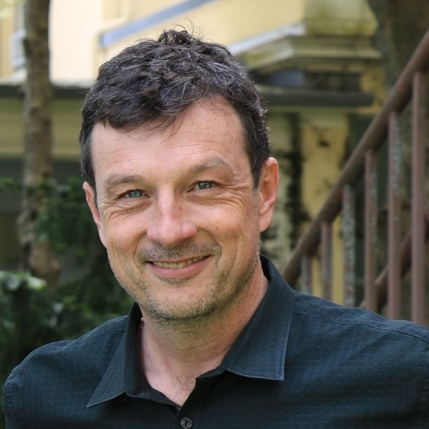
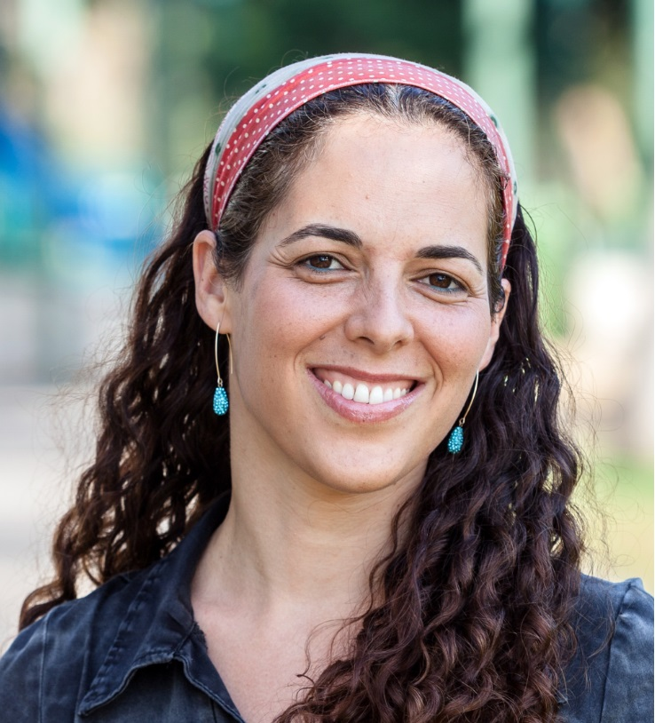

# **Keynote Speakers** #
___

 

- <a href="https://campuspress.yale.edu/dirkbergemann/">Dirk Bergemann</a>, Professor, Yale University
- <a href="https://www.elloraderenoncourt.com/">Ellora Derenoncourt</a>, Assistant Professor, University of California, Berkeley
- <a href="https://web.stanford.edu/~ashishg/">Ashish Goel</a>, Professor, Stanford University
- <a href="https://marylgray.org/">Mary L. Gray</a>, Senior Principal Researcher, Microsoft Research
- <a href="https://people.mpi-sws.org/~gummadi/">Krishna Gummadi</a>, Scientific Director, Max Planck Institute for Software Systems
- <a href="https://u.cs.biu.ac.il/~avinatan/">Avinatan Hassidim</a>, Professor, Bar Ilan University
- <a href="https://www.some.ox.ac.uk/people/radhika-khosla/">Radhika Khosla</a>, Associate Professor, University of Oxford 
- <a href="https://www.gob.mx/mejoredu/articulos/sylvia-ortega-salazar-fue-elegida-por-unanimidad-como-presidenta-del-consejo-ciudadano-de-mejoredu">Sylvia Ortega Salazar</a>, Senior Consultant, National College of Vocational and Professional Training
- <a href="https://bdtrust.org/trooper-sanders/">Trooper Sanders</a>, CEO, Benefits Data Trust

# **Discussants** #
___

 

- <a href="https://ericwchan.com/">Eric W. Chan</a>, Assistant Professor, Babson College
- <a href="https://www.mfeldman.sites.tau.ac.il/">Michal Feldman</a>, Professor, Tel-Aviv University
- <a href="http://www.linardi.gspia.pitt.edu/">Sera Linardi</a>, Associate Professor, University of Pittsburgh
- <a href="https://researchictafrica.net/author/araba-sey/">Araba Sey</a>, Principal Researcher, Research ICT Africa

 

# **Keynote Speakers Bios and Abstracts** #
___

 

## Dirk Bergemann ##
#### Professor, Yale University ####

---

<a href="https://campuspress.yale.edu/dirkbergemann/">Dirk Bergemann</a> is the Douglass and Marion Campbell Professor of Economics at Yale University. He has secondary appointments as Professor of Computer Science in the School of Engineering and Professor of Finance in the School of Management. He received his Ph.D. in Economics from the University of Pennsylvania in 1994. He joined Yale in 1995 as an assistant professor, having previously served as a faculty member at Princeton University. He has been affiliated with the Cowles Foundation for Research in Economics at Yale since 1996 and a fellow of the Econometric Society since 2007. Dirk Bergemann was Chair of the Department of Economics from 2013-2019 and Co-Editor of Econometrica from 2014-2018. He was recently appointed as Co-Editor of American Economic Review: Insights, 2020- and is a Member of the Executive Committee of the Econometric Society 2021. His research is in the area of game theory, contract theory, venture capital and market design. His most recent work is in the area of dynamic mechanism design and dynamic pricing, robust mechanism design, and information design. His research has been supported by grants from the National Science Foundation, the Alfred P. Sloan Research Fellowship, Google Faculty Fellow, the Knight Foundation, the Omidyar Network and the German National Science Foundation.
 

 <h3 align="center"> Data for Service </h3> 

Abstract: Digital platforms commonly neither buy nor sell information direction, but rather indirectly. Namely, the trade in individual and social data is bundled with goods and services. For example, a search engine sells information about the searcher together with a query via sponsored search auction. A social network matches advertisers and individual consumers with certain characteristics. As a consequence, digital platforms typically do not compensate individual consumers directly for their information, but rather provide services whose benefits are naturally increasing in the amounts of information they generate. We investigate to what extent the barter of information for service leads to efficient and fair trade in online data markets.

  

## Ellora Derenoncourt ##
#### Assistant Professor, University of California, Berkeley ####

---

<a href="https://www.elloraderenoncourt.com/">Ellora Derenoncourt</a> is a labor economist and economic historian whose work focuses on inequality. Her recent studies have examined northern backlash against the Great Migration and ensuing reductions in Black upward mobility and the role of federal minimum wage policy in closing the racial earnings gap in the Civil Rights Era. She has also written on wage determination in low-wage labor markets and the evolution of the racial wealth gap from pre-Emancipation to the present. Her work has been featured in the Economist, the New York Times, the Wall Street Journal, Fortune Magazine, and NPR. Dr. Derenoncourt received her PhD in Economics from Harvard University in 2019, her MSc in Human Geography from the London School of Economics, and her A.B. at Harvard University.
 

 <h3 align="center"> Racial inequality in the 21st century </h3> 

Abstract: The talk covers two key lessons from history for the future of racial inequality and public policy making in the United States.

 

## Ashish Goel ##
#### Professor, Stanford University ####

---

<a href="https://web.stanford.edu/~ashishg/">Ashish Goel</a> is a Professor of Management Science and Engineering and (by courtesy) Computer Science at Stanford University. He received his PhD in Computer Science from Stanford in 1999, and was an Assistant Professor of Computer Science at the University of Southern California from 1999 to 2002. His research interests lie in the design, analysis, and applications of algorithms; current application areas of interest include social networks, participatory democracy, Internet commerce, and large scale data processing. He has received an Alfred P. Sloan faculty fellowship (2004-06) and a Rajeev Motwani mentorship award (2010). He was a co-author on the paper that won the best paper award at WWW 2009, an Edelman Laureate in 2014, and a co-winner of the SigEcom Test of Time Award in 2018. Professor Goel was a research fellow and technical advisor at Twitter, Inc. from July 2009 to Aug 2014.
 

 <h3 align="center"> Fairness in Social Choice and Public Resource Allocation </h3> 

Abstract: Fairness has been an important criterion in social choice since its inception, both as an epistemic concept (i.e. fairness in terms of the outcome), and in terms of participants having an equitable voice.  We will describe a practical deployment that brings issues of equitable voice to the fore, and then present a stylized approach for fair outcomes in public decision making. On the practical side, we discuss a feedback process we ran on behalf of the city of Austin in the spring of 2020. The George Floyd protests happened in the middle of the process, resulting in a dramatic increase in public interest in the feedback process, and a shift in the nature of the feedback. The stylized theoretical  result involves achieving fair outcomes in public decision making via reduction to a public goods market. We claim that bridging the gap between the normative issues that we discuss and the kind of stylized models we can analyze is one of the most important problems in social choice. This represents joint work with Yiling Chen, Nikhil Garg, Lodewijk Gelauff, and Benjamin Plaut.

 

## Mary Gray ##
#### Senior Principal Researcher, Microsoft Research ####

---

<a href="https://marylgray.org/">Mary L. Gray</a> is Senior Principal Researcher at Microsoft Research and Faculty Associate at Harvard University’s Berkman Klein Center for Internet and Society. She maintains a faculty position in the Luddy School of Informatics, Computing, and Engineering with affiliations in Anthropology and Gender Studies at Indiana University. Mary, an anthropologist and media scholar by training, focuses on how people’s everyday uses of technologies transform labor, identity, and human rights. She sits on several boards, including Public Responsibility in Medicine and Research and the California Governor’s Council of Economic Advisors, in addition to chairing the Microsoft Research Ethics Review Program—the only federally-registered institutional review board of its kind in the tech industry. In 2020, Mary was named a MacArthur Fellow for her contributions to anthropology and the study of technology, digital economies, and society.
 

 <h3 align="center"> More than Fair: How to Bring Communities, Computer Science, and the Social Sciences Together to Build for Social Justice </h3> 

Abstract: Data and technological innovations are meant to make life easier—to help us optimize the speed of decision-making and create efficiencies that amplify our impact. In the world of community health, this impact can mean life or death. And, as the pandemic has shown us, technologies built without engaging communities or narrowly focused on what those in power want generates more work and inequity in the process. Drawing on principles eloquently articulated in 2020 by scholar Sasha Costanza-Chock in Design Justice, this talk will share research insights from a 6-month study of community-based organizations (CBOs) in North Carolina serving marginalized Black and Latinx communities across the State. This coalition of CBOs operates as a grassroots extension of public health and have become pivotal conduits for COVID-19 health information and education, access to food, shelter, and equitable vaccine access. This keynote will discuss the promises and challenges of bringing industry engineers, social scientists, and this CBO coalition to the table to develop open-source software to CBO needs with justice, rather than efficiency, as the North Star. The talk will open with considering how unexamined investments in measuring bias and fairness in training data or computing systems distract us from what difference it might make to collect data and develop tech with rather than for communities. The talk then shares the research team’s methodologies and frameworks for balancing the demands of collecting community members’ health data with efforts to create a new mechanism for CBOs to cost share serving as community data trusts. While one aspect of the study was to understand what a better electronic intake form might look like for CBOs that, typically, lack the resources to buy—let alone build and maintain—sophisticated software or data management systems, the larger focus of the research is to explore what it means to truly build with, rather than for, community groups and societal resilience more broadly. Specifically, what does it mean to focus deeply on social interactions that are computationally hard to see or measure but qualitatively invaluable and necessary to advance social justice? The talk will conclude with recommendations for how to reorient computer science to a more explicit theory and practice of power-sharing.

 

## Krishna Gummadi ##
#### Scientific Director, Max Planck Institute for Software Systems ####

---

<a href="https://people.mpi-sws.org/~gummadi/">Krishna Gummadi</a> is a scientific director at the Max Planck Institute for Software Systems (MPI-SWS) and a professor at the University of Saarland in Germany. Krishna's research interests are in the measurement, analysis, design, and evaluation of complex Internet-scale systems, particularly social computing systems. His work on fair machine learning, online social networks and media, Internet access networks, and peer-to-peer systems has been widely cited and his papers have received numerous awards, including Test of Time Awards at ACM SIGCOMM and AAAI ICWSM, Casper Bowden Privacy Enhancing Technologies (PET) and CNIL-INRIA Privacy Runners-Up Awards, IW3C2 WWW Best Paper Honorable Mention, and Best Papers at NIPS ML & Law Symposium, ACM COSN, ACM/Usenix SOUPS, AAAI ICWSM, Usenix OSDI, ACM SIGCOMM IMC, ACM SIGCOMM CCR, and SPIE MMCN.  He received an ERC Advanced Grant in 2017 to investigate "Foundations for Fair Social Computing."
 

 <h3 align="center"> Fairness in Multisided / Multistakeholder Online Platforms </h3> 

Abstract: Algorithmic (data-driven) nudges are increasingly being used to help human decision makers on a variety of match-/market- making platforms from gig-economy and e-commerce platforms to online conferencing and charity platforms. A defining feature of these platforms is that they are multisided, i.e., the algorithms mediate interactions between multiple sets of stakeholders. Many existing notions of individual and group fairness in algorithmic fairness literature have largely been inspired by predictive risk assessment contexts (e.g., credit or recidivism risk assessments) that are often single sided. As such, these notions are insufficient to address difficult fairness considerations that arise when the mediating algorithm can trade-off beneficial outcomes for one side with those of the other side(s). In this talk, I will discuss the challenges we faced in our attempts to define and operationalize fairness notions in the context of a ride-sharing platform, an e-commerce platform and an online donations platform.

 

  
## Avinatan Hassidim ##
#### Professor, Bar Ilan University ####

---

<a href="https://u.cs.biu.ac.il/~avinatan/">Avinatan Hassidim</a> is a professor of computer Science at Bar Ilan University, and a director in Google research where he leads the Israel research group. His main research interest is market design, and specifically matching markets. In addition to do theoretical work, Avinatan designed the Israeli medical interns lottery, the Israeli Psychology Match and the Israeli Lawyers' match. Avinatan's group at Google did projects from Flood Forecasting (system protects 200M people in India and Bangladesh), Looking to Listen, Google Duplex and Euphonia. Avinatan's work has won numerous awards, including Editor's choice PRL 2010, Best paper award SIGMETRICS 2011, and Runner Up for Best Paper INFOCOM 2012&2013.

 

 <h3 align="center"> Need vs. Merit: The Large Core of College Admissions Markets </h3> 

Abstract: We study college admissions markets, where colleges offer multiple funding levels. Colleges wish to recruit the best-qualified students subject to budget and capacity constraints. Student-proposing deferred acceptance is stable and strategy-proof for students, but the set of stable allocations is large and the scope for manipulation by colleges is substantial, even in large markets. Under deferred acceptance, truthful colleges allocate funding based on merit. Successful manipulations consider applicants' outside options (specifically need) when allocating funding. In Hungary, where the centralized clearinghouse uses deferred acceptance, choosing another stable allocation would increase the number of admitted students by at least 3%.

 

  
## Radhika Khosla ##
#### Associate Professor, University of Oxford ####

---
 

<a href="https://www.some.ox.ac.uk/people/radhika-khosla/">Dr. Radhika Khosla</a> is Associate Professor at the Smith School of Enterprise and Environment and Research Director of the Oxford India Centre for Sustainable Development at the University of Oxford. She works on examining the productive tensions between urban transitions, energy services consumption, and climate change, with a focus on developing country cities. Radhika is also the Principal Investigator of the Oxford Martin School's interdisciplinary and multi-country program on the Future of Cooling, and co-investigator for the Oxford Net Zero program. She is a contributing author to the sixth assessment report of the Intergovernmental Panel on Climate Change (IPCC) and lead author of the UNEP Emissions Gap Report. She is a member of the UK Government’s UK-India Advisory Committee and serves on boards of journals, advancing interdisciplinary understanding of how cities in transition manage the tensions of meeting growing energy needs for development while protecting the local and global environment. Previously, she has been at the Massachusetts Institute of Technology, a Fellow at the Centre for Policy Research in New Delhi, and Staff Scientist at the Natural Resources Defense Council in New York. Radhika holds a Ph.D in the Geophysical Sciences from the University of Chicago and undergraduate and Master's degrees in Physics from the University of Oxford.
 

 <h3 align="center"> Sustainability Transitions in a Changing Climate </h3> 

  

## Sylvia Ortega Salazar ##
#### Senior Consultant, National College of Vocational and Professional Training ####

---

 
 Sociologist and educator, <a href="https://www.gob.mx/mejoredu/articulos/sylvia-ortega-salazar-fue-elegida-por-unanimidad-como-presidenta-del-consejo-ciudadano-de-mejoredu">Dr. Sylvia Ortega Salazar</a> served as Vice minister for Upper High School and VET of México. She has been Rector of the Metropolitan Autonomous University-Azcapotzalco; General Director of International Cooperation at the National Council for Science and Technology (CONACyT), Vice minister of Basic Education in Mexico City, Rector of the National Pedagogical University and General Director of the Colegio de Bachilleres, a network of public upper high schools. She was the first woman Rector of a public University in Mexico and has received numerous recognitions for academic achievement, public service and contributions to international education. Widely published, her lines of research include educational policy design and practice; teacher training and professional development; theories of educational change; dual models of education and employability. She currently serves as principal consultant to the Colegio Nacional de Educación Profesional Técnica (CONALEP). As of January 2021, she was elected President of the National Advisory Council in Education. Dr. Ortega obtained a BA degree in Sociology at the National Autonomous University of Mexico, an MSc from the University of Wisconsin and a Ph.D. at the University of Texas. She resides in Mexico City.
 

 <h3 align="center"> New Approaches to Public Policy Design in Education: The Thrust towards Inclusion, Quality and Justice in Mexico </h3> 

Abstract: A Century ago, the emerging post-revolutionary Mexican State founded the Ministry of Public Education, an essential component of a national project centered on integrating a dispersed, diverse and illiterate population. Since, the Mexican System of Education, increasingly large and complex, has purported to provide access to all. Critical assessments have clearly shown that a thorough shift in educational policy making and implementation is needed if social justice is to be advanced. In this presentation, we argue that the recently redefined goals and objectives of public education provide an adequate framework to reinvent the system, redesign policy and, more importantly, create flexible and effective processes of implementation of interventions characterized by their sensitivity to diversity, spatial and social contexts as well as communities´ and individuals’ aspirations.

 

## Trooper Sanders ##
#### CEO, Benefits Data Trust ####

---

 
A Detroit native, <a href="https://bdtrust.org/trooper-sanders/">Trooper</a> has more than 20 years of experience working at the crossroads of business, government, and the nonprofit sector. He currently serves as Chief Executive Officer at Benefits Data Trust, a national nonprofit that helps people live healthier, more independent lives by creating smarter ways to access essential benefits and services. Prior to joining BDT, Trooper was a social impact and policy advisor to financial technology startups, business leaders, and philanthropic initiatives. At the Clinton Foundation, Trooper helped create the Alliance for a Healthier Generation, a joint venture with the American Heart Association to reduce obesity in the U.S. Trooper also held White House policy staff positions during two separate administrations. He most recently served as a Rockefeller Foundation Fellow, carrying out a project to identify opportunities to ensure that artificial intelligence improves social and economic equity. Trooper is a graduate of the University of Michigan and holds a Master of Science degree from the London School of Economics and a Master of Laws from the University of London.
 
 

 <h3 align="center"> Fusing code and prose: blending and balancing the quantitative and qualitative in advancing equity </h3> 

Abstract: More than $60 billion in assistance for Americans to buy food, access health care, and meet other essential needs go untapped each year. Benefits Data Trust is an interdisciplinary nonprofit bringing quantitative and qualitative expertise to helping people apply for benefits, supporting improvements in government’s delivery of benefits services, and maximizing the role of benefits in advancing better health outcomes, greater economic security, and racial equity. Lessons from and questions facing BDT as it builds a high performing and integrated interdisciplinary team will be offered as part of encouraging those skilled at working in code to advance equity by building bridges and shared purpose with those who work in prose.

 

 

# **Discussants Bios** #
___

 

## Eric W. Chan ##
#### Assistant Professor, Babson College ####

---

<a href="https://ericwchan.com/">Eric W. Chan </a> is an Assistant Professor of Statistics and Public Policy at Babson College. Motivated by a
previous career in education and public policy, his research focuses on the role that parents and parent-
focused interventions play in children’s academic outcomes. He is also deeply interested in the interplay
between residential choice and school choice, and the mechanisms that enhances or discourages such
choices. He has assisted school districts in designing parent engagement surveys and worked with
several technology platforms on designing effective educational interventions. Dr. Chan received a BS
degree in Business Management from Babson College, a MA and M.Phil from Teachers College,
Columbia University, and a Ph.D. in Economics and Education from Columbia University.
 

## Michal Feldman ##
#### Professor of Computer Science, Tel-Aviv University ####

---

 
<a href="https://en-exact-sciences.tau.ac.il/EC/Meet-Michal-Feldman">Michal Feldman</a> is the Computation and Economics Professor of Computer Science in the Blavatnik School of Computer Science at Tel Aviv University and a visiting scholar at Microsoft Research (MSR) Herzliya. Her research spans computer science, economics, game theory and operations research. She received her Ph.D. from the University of California at Berkeley in 2005. She held a visiting position at Harvard University and Microsoft Research New England (2011-13). She is an Associate Editor in Games and Economic Behavior, Mathematics of Operations Research, ACM Transactions on Economics and Computation, and Journal of Computer and System Sciences. She served as Vice Chair of ACM SIGecom, and PC chair of ACM EC 2015. She is an alumna of the Global Young Academy of Sciences, and the Israeli Young Academy of Sciences (and its management committee). She is the recipient of two ERC grants of the European Research Council, Marie Curie IOF, Alon, ISF and Amazon Research Award. She was listed in Forbes' list of the 50 most influential women in Israel (2016), and in the The Marker's list 40 under 40 (2014).
 

## Sera Linardi ##
#### Associate Professor of Economics, University of Pittsburgh ####

---

 
<a href="http://www.linardi.gspia.pitt.edu/">Sera Linardi</a> is an Associate Professor of Economics at the Graduate School of Public and International Affairs (GSPIA) at the University of Pittsburgh with appointments at the Intelligent Systems Program at the School of Computing and Information and the Department of Economics at Arts & Sciences. Sera founded and direct the Center for Analytical Approaches to Social Innovation (CAASI). Projects currently managed within CAASI includes Pitt Smart Living Human Behavior Laboratory (video) with SCI (NSF #1739413), the Heinz Endowments funded Pitt Wage Study (School of Social Work, SEIU), and an RCT on service utilization among the previously incarcerated with TAMU Econ (funded by the Rapoport Foundation). The lab also recently started the Tipped Worker study (Pitt Law, Katz, SSW, WSU, and Restaurant Opportunity Center). Sera received her PhD in Social Science at the California Institute of Technology in 2010. Before Caltech, Sera was a computer scientist at Adobe Systems, working on the PDF file technology. As an experimental economist in a school of public affairs, I bridge academic research and the day-to-day challenges facing those who provide services to vulnerable populations. Her research focuses on 1) the supply of donated funds and labor (prosocial behavior), 2) the ability for decision makers to aggregate mission-critical information, and 3) the behavior of the population targeted for service.
 
  

## Araba Sey ##
#### Principal Researcher, Research ICT Africa ####

---

 
<a href="https://researchictafrica.net/author/araba-sey/">Araba Sey</a> is a Principal Researcher with Research ICT Africa, and a Principal Research Scientist at the University of Washington Information School. Her research examines digital and social inequalities and explores ways to foster diversity and inclusion. Ongoing projects include studies of gender digital equality in global, regional and national contexts; trends in the deployment of artificial intelligence for development in Africa; misinformation and disinformation in Africa, and approaches to democratizing knowledge creation through inclusive research design and decision-making processes that embrace different types of knowledge.
 
 
 
