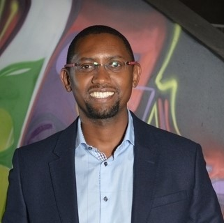

# **Keynote Speakers** #
___

 

## Solomon Assefa ##
#### Vice President, IBM Research ####

---

<a href="https://researcher.watson.ibm.com/researcher/view.php?person=us-sassefa">Dr. Solomon Assefa</a> is a Vice President at IBM Research. He heads research strategy, execution, commercialization, and partnerships for Impact Science, which includes Future of Climate, Future of Work, and Future of Health. Under his leadership, researchers from IBM’s global labs are applying and advancing disruptive technologies that will transform industries and benefit society. Dr. Assefa is also responsible for IBM’s research labs in Kenya and South Africa, and heads IBM’s research strategy and partnership across Middle East and Africa. As a Research Scientist, Dr. Assefa has worked on IBM’s nanophotonics technology with responsibilities spanning research, development, and technology transfer. He has also worked on field switched and spin torque MRAM technologies. He has co-authored over 150 publications in peer-reviewed journals and conference proceedings and has over 50 patents. Dr. Assefa received a B.S. in Physics (2001), a B.S. in EECS (2001), a M.S. in EECS (2001), and a Ph.D. (2004) all from the Massachusetts Institute of Technology (MIT).
 

## Dirk Bergemann ##
#### Professor, Yale University ####

---

<a href="https://campuspress.yale.edu/dirkbergemann/">Dirk Bergemann</a> is the Douglass and Marion Campbell Professor of Economics at Yale University. He has secondary appointments as Professor of Computer Science in the School of Engineering and Professor of Finance in the School of Management. He received his Ph.D. in Economics from the University of Pennsylvania in 1994. He joined Yale in 1995 as an assistant professor, having previously served as a faculty member at Princeton University. He has been affiliated with the Cowles Foundation for Research in Economics at Yale since 1996 and a fellow of the Econometric Society since 2007. Dirk Bergemann was Chair of the Department of Economics from 2013-2019 and Co-Editor of Econometrica from 2014-2018. He was recently appointed as Co-Editor of American Economic Review: Insights, 2020- and is a Member of the Executive Committee of the Econometric Society 2021. His research is in the area of game theory, contract theory, venture capital and market design. His most recent work is in the area of dynamic mechanism design and dynamic pricing, robust mechanism design, and information design. His research has been supported by grants from the National Science Foundation, the Alfred P. Sloan Research Fellowship, Google Faculty Fellow, the Knight Foundation, the Omidyar Network and the German National Science Foundation.
 

## Ellora Derenoncourt ##
#### Assistant Professor, University of California, Berkeley ####

---

<a href="https://www.elloraderenoncourt.com/">Ellora Derenoncourt</a> is a labor economist and economic historian whose work focuses on inequality. Her recent studies have examined northern backlash against the Great Migration and ensuing reductions in Black upward mobility and the role of federal minimum wage policy in closing the racial earnings gap in the Civil Rights Era. She has also written on wage determination in low-wage labor markets and the evolution of the racial wealth gap from pre-Emancipation to the present. Her work has been featured in the Economist, the New York Times, the Wall Street Journal, Fortune Magazine, and NPR. Dr. Derenoncourt received her PhD in Economics from Harvard University in 2019, her MSc in Human Geography from the London School of Economics, and her A.B. at Harvard University.
 

## Ashish Goel ##
#### Professor, Stanford University ####

---

<a href="https://web.stanford.edu/~ashishg/">Ashish Goel</a> is a Professor of Management Science and Engineering and (by courtesy) Computer Science at Stanford University. He received his PhD in Computer Science from Stanford in 1999, and was an Assistant Professor of Computer Science at the University of Southern California from 1999 to 2002. His research interests lie in the design, analysis, and applications of algorithms; current application areas of interest include social networks, participatory democracy, Internet commerce, and large scale data processing. He has received an Alfred P. Sloan faculty fellowship (2004-06) and a Rajeev Motwani mentorship award (2010). He was a co-author on the paper that won the best paper award at WWW 2009, an Edelman Laureate in 2014, and a co-winner of the SigEcom Test of Time Award in 2018. Professor Goel was a research fellow and technical advisor at Twitter, Inc. from July 2009 to Aug 2014.
 

## Mary Gray ##
#### Senior Principal Researcher, Microsoft Research ####

---

<a href="https://marylgray.org/">Mary L. Gray</a> is Senior Principal Researcher at Microsoft Research and Faculty Associate at Harvard University’s Berkman Klein Center for Internet and Society. She maintains a faculty position in the Luddy School of Informatics, Computing, and Engineering with affiliations in Anthropology and Gender Studies at Indiana University. Mary, an anthropologist and media scholar by training, focuses on how people’s everyday uses of technologies transform labor, identity, and human rights. She sits on several boards, including Public Responsibility in Medicine and Research and the California Governor’s Council of Economic Advisors, in addition to chairing the Microsoft Research Ethics Review Program—the only federally-registered institutional review board of its kind in the tech industry. In 2020, Mary was named a MacArthur Fellow for her contributions to anthropology and the study of technology, digital economies, and society.
 

## Krishna Gummadi ##
#### Scientific Director, Max Planck Institute for Software Systems ####

---

<a href="https://people.mpi-sws.org/~gummadi/">Krishna Gummadi</a> is a scientific director at the Max Planck Institute for Software Systems (MPI-SWS) and a professor at the University of Saarland in Germany. Krishna's research interests are in the measurement, analysis, design, and evaluation of complex Internet-scale systems, particularly social computing systems. His work on fair machine learning, online social networks and media, Internet access networks, and peer-to-peer systems has been widely cited and his papers have received numerous awards, including Test of Time Awards at ACM SIGCOMM and AAAI ICWSM, Casper Bowden Privacy Enhancing Technologies (PET) and CNIL-INRIA Privacy Runners-Up Awards, IW3C2 WWW Best Paper Honorable Mention, and Best Papers at NIPS ML & Law Symposium, ACM COSN, ACM/Usenix SOUPS, AAAI ICWSM, Usenix OSDI, ACM SIGCOMM IMC, ACM SIGCOMM CCR, and SPIE MMCN.  He received an ERC Advanced Grant in 2017 to investigate "Foundations for Fair Social Computing."
 

  
## Avinatan Hassidim ##
#### Professor, Bar Ilan University ####

---

<a href="https://u.cs.biu.ac.il/~avinatan/">Avinatan Hassidim</a> is a professor of computer Science at Bar Ilan University, and a director in Google research where he leads the Israel research group. His main research interest is market design, and specifically matching markets. In addition to do theoretical work, Avinatan designed the Israeli medical interns lottery, the Israeli Psychology Match and the Israeli Lawyers' match. Avinatan's group at Google did projects from Flood Forecasting (system protects 200M people in India and Bangladesh), Looking to Listen, Google Duplex and Euphonia. Avinatan's work has won numerous awards, including Editor's choice PRL 2010, Best paper award SIGMETRICS 2011, and Runner Up for Best Paper INFOCOM 2012&2013.

 

  
## Radhika Khosla ##
#### Associate Professor, University of Oxford ####

---
 

<a href="https://www.some.ox.ac.uk/people/radhika-khosla/">Dr. Radhika Khosla</a> is Associate Professor at the Smith School of Enterprise and Environment and Research Director of the Oxford India Centre for Sustainable Development at the University of Oxford. She works on examining the productive tensions between urban transitions, energy services consumption, and climate change, with a focus on developing country cities. Radhika is also the Principal Investigator of the Oxford Martin School's interdisciplinary and multi-country program on the Future of Cooling, and co-investigator for the Oxford Net Zero program. She is a contributing author to the sixth assessment report of the Intergovernmental Panel on Climate Change (IPCC) and lead author of the UNEP Emissions Gap Report. She is a member of the UK Government’s UK-India Advisory Committee and serves on boards of journals, advancing interdisciplinary understanding of how cities in transition manage the tensions of meeting growing energy needs for development while protecting the local and global environment. Previously, she has been at the Massachusetts Institute of Technology, a Fellow at the Centre for Policy Research in New Delhi, and Staff Scientist at the Natural Resources Defense Council in New York. Radhika holds a Ph.D in the Geophysical Sciences from the University of Chicago and undergraduate and Master's degrees in Physics from the University of Oxford.
 

## Sylvia Ortega Salazar ##
#### Principal Consultant, CONALEP ####

---

 
 Sociologist and educator, <a href="https://www.gob.mx/mejoredu/articulos/sylvia-ortega-salazar-fue-elegida-por-unanimidad-como-presidenta-del-consejo-ciudadano-de-mejoredu">Dr. Sylvia Ortega Salazar</a> served as Vice minister for Upper High School and VET of México. She has been Rector of the Metropolitan Autonomous University-Azcapotzalco; General Director of International Cooperation at the National Council for Science and Technology (CONACyT), Vice minister of Basic Education in Mexico City, Rector of the National Pedagogical University and General Director of the Colegio de Bachilleres, a network of public upper high schools. She was the first woman Rector of a public University in Mexico and has received numerous recognitions for academic achievement, public service and contributions to international education. Widely published, her lines of research include educational policy design and practice; teacher training and professional development; theories of educational change; dual models of education and employability. She currently serves as principal consultant to the Colegio Nacional de Educación Profesional Técnica (CONALEP). As of January 2021, she was elected President of the National Advisory Council in Education. Dr. Ortega obtained a BA degree in Sociology at the National Autonomous University of Mexico, an MSc from the University of Wisconsin and a Ph.D. at the University of Texas. She resides in Mexico City.
 

## Trooper Sanders ##
#### CEO, Benefits Data Trust ####

---

 
A Detroit native, <a href="https://bdtrust.org/trooper-sanders/">Trooper</a> has more than 20 years of experience working at the crossroads of business, government, and the nonprofit sector. He currently serves as Chief Executive Officer at Benefits Data Trust, a national nonprofit that helps people live healthier, more independent lives by creating smarter ways to access essential benefits and services. Prior to joining BDT, Trooper was a social impact and policy advisor to financial technology startups, business leaders, and philanthropic initiatives. At the Clinton Foundation, Trooper helped create the Alliance for a Healthier Generation, a joint venture with the American Heart Association to reduce obesity in the U.S. Trooper also held White House policy staff positions during two separate administrations. He most recently served as a Rockefeller Foundation Fellow, carrying out a project to identify opportunities to ensure that artificial intelligence improves social and economic equity. Trooper is a graduate of the University of Michigan and holds a Master of Science degree from the London School of Economics and a Master of Laws from the University of London.
 
 

## Araba Sey ##
#### Principal Researcher, Research ICT Africa ####

---

 
A Detroit native, <a href="https://researchictafrica.net/author/araba-sey/">Araba Sey</a> is a Principal Researcher with Research ICT Africa, and a Principal Research Scientist at the University of Washington Information School. Her research examines digital and social inequalities and explores ways to foster diversity and inclusion. Ongoing projects include studies of gender digital equality in global, regional and national contexts; trends in the deployment of artificial intelligence for development in Africa; misinformation and disinformation in Africa, and approaches to democratizing knowledge creation through inclusive research design and decision-making processes that embrace different types of knowledge.
 
